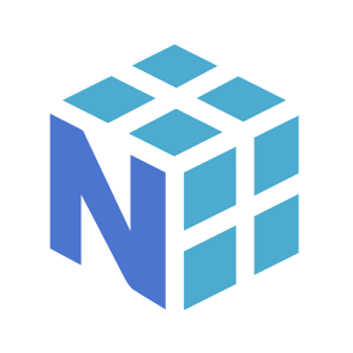
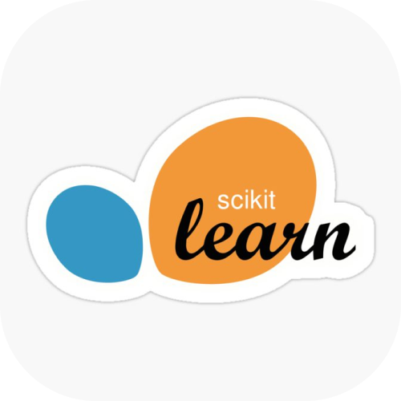
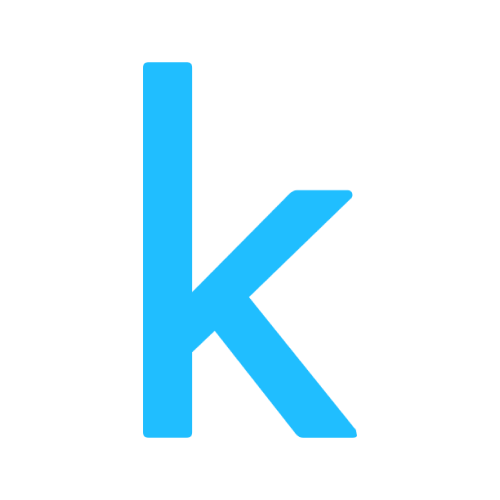

 

---

### ◈ &nbsp;ABOUT

> Passionate about building impactful tech — AI-powered healthcare, scalable social platforms, intelligent systems.
> Currently deep in **React · Firebase · Vision Transformers · RAG architectures**.
> Always curious. Always shipping.

| | |
|---|---|
| 🎓 | CSE @ College of Engineering Trivandrum |
| 🔭 | Building AI-powered applications |
| 🧠 | Exploring ML deployment & RAG systems |
| ⚡ | Interests: Deep Learning · FinTech · AI Products |

---

### ◈ &nbsp;STATS

 

---

### ◈ &nbsp;ACTIVITY

---

### ◈ &nbsp;LANGUAGES

---

### ◈ &nbsp;TECH STACK

**Languages**
 

**Frameworks & Cloud**
 

**Databases**
 

**AI · ML · Data**
 

&nbsp;
&nbsp;
&nbsp;
&nbsp;

**Tools & DevOps**
 

---

### ◈ &nbsp;TROPHIES

---

